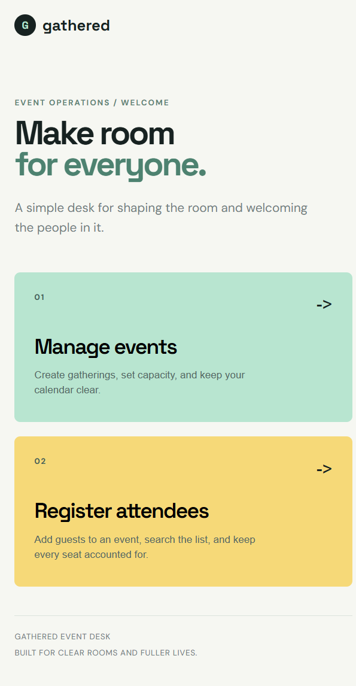
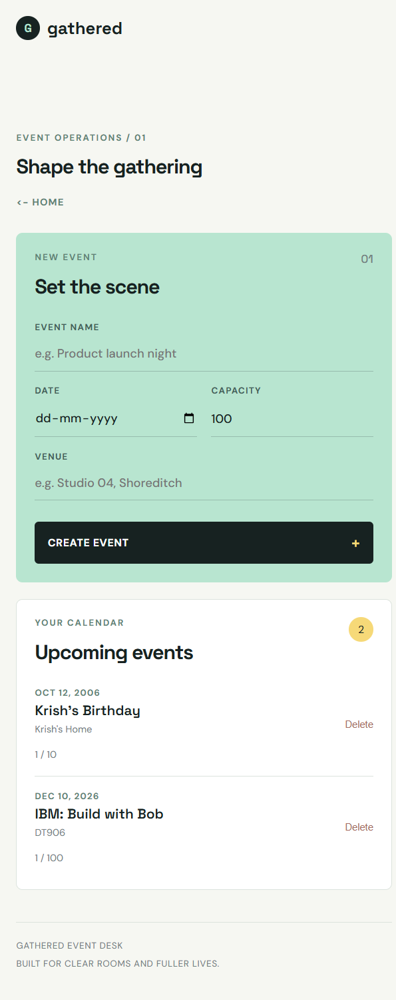
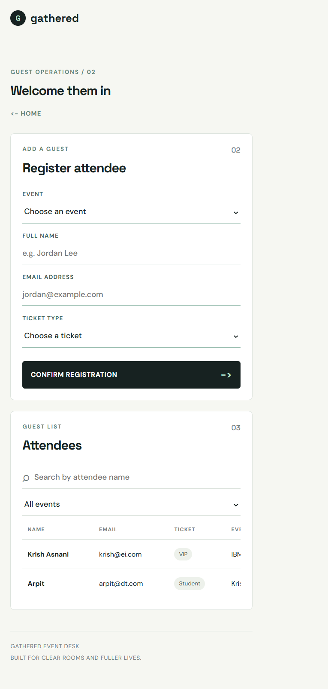

# Event & Attendee Management System

## Project Report

**Application:** Gathered Event & Attendee Manager  
**Stack:** HTML, CSS, vanilla JavaScript, Node.js, Express, SQLite  
**Architecture:** Single-page application frontend with a REST API backend  
**Database:** SQLite using `better-sqlite3`

## 1. Introduction

The Event & Attendee Management System is a web application for creating events and managing registrations. It provides a simple workflow for event organizers to define an event, set its capacity, register attendees, search guest records, and remove records when necessary.

The application uses a single-page frontend. Users begin at a homepage and choose one of two workflows:

1. **Manage events** - create events, view upcoming events, see capacity usage, and delete events.
2. **Register attendees** - register guests, search the attendee list, filter by event, and delete attendee records.

View changes happen with JavaScript, so the browser does not reload while moving through the application or submitting forms.

## 2. Objectives

The project meets the following objectives:

- Create and list events.
- Register attendees to a selected event.
- Maintain a one-to-many event-to-attendee relationship.
- Search attendees by name.
- Filter attendees by event.
- Delete attendees.
- Delete events and their related attendees.
- Reject invalid, duplicate, and over-capacity registrations.
- Provide clear HTTP status codes and error messages.
- Update the page dynamically using Fetch API calls.

## 3. Technologies Used

| Technology | Purpose |
| --- | --- |
| HTML5 | Semantic page structure and forms |
| CSS3 | Responsive visual design and workflow screens |
| JavaScript | SPA navigation, validation, Fetch calls, and DOM rendering |
| Node.js | Backend JavaScript runtime |
| Express | REST API and static frontend server |
| SQLite | Local relational database |
| better-sqlite3 | Synchronous SQLite driver for Node.js |

## 4. Project Structure

```text
.
├── server.js
├── package.json
├── package-lock.json
├── events.db
├── README.md
├── REPORT.md
├── report-home.png
├── report-events.png
├── report-attendees.png
└── public/
    ├── index.html
    ├── style.css
    └── app.js
```

The `events.db` file is created automatically when the server starts. The report screenshots are included in the project root for documentation and presentation use.

## 5. User Interface and Complete Flow

### 5.1 Homepage

The homepage introduces the application and gives the user two clear choices. This keeps the interface focused instead of displaying every form at the same time.



The user can select:

- **Manage events** to create and maintain events.
- **Register attendees** to add and manage guests.

The page remains a single-page application because JavaScript changes the visible view without navigating to a different HTML page.

### 5.2 Event Management Flow

1. The user selects **Manage events** from the homepage.
2. The event form requests:
   - Event name
   - Date
   - Venue
   - Capacity
3. The frontend performs quick validation.
4. The form sends a `POST /api/events` request.
5. The backend validates and stores the event in SQLite.
6. The event list is fetched again and rendered without a reload.
7. Each event displays its current registration count and capacity.
8. The user can delete an event. The backend deletes its attendees automatically through `ON DELETE CASCADE`.



### 5.3 Attendee Registration Flow

1. The user selects **Register attendees** from the homepage.
2. The event dropdown is populated from `GET /api/events`.
3. The user enters:
   - Event
   - Full name
   - Email address
   - Ticket type
4. The frontend checks required fields and email format.
5. The form sends `POST /api/events/:id/attendees`.
6. The backend checks that the event exists.
7. The backend checks email validity, ticket type, capacity, and duplicate registration.
8. A successful attendee is stored and the guest list is fetched again.
9. The attendee table supports name search and event filtering.
10. An attendee can be deleted with `DELETE /api/attendees/:id`.



## 6. Database Design

The system uses a one-to-many relationship:

- One event can have many attendees.
- Each attendee belongs to exactly one event.

```sql
CREATE TABLE events (
  id INTEGER PRIMARY KEY AUTOINCREMENT,
  name TEXT NOT NULL,
  date TEXT NOT NULL,
  venue TEXT NOT NULL,
  capacity INTEGER NOT NULL DEFAULT 100
);

CREATE TABLE attendees (
  id INTEGER PRIMARY KEY AUTOINCREMENT,
  name TEXT NOT NULL,
  email TEXT NOT NULL,
  ticket_type TEXT NOT NULL CHECK (ticket_type IN ('General', 'VIP', 'Student')),
  event_id INTEGER NOT NULL,
  FOREIGN KEY (event_id) REFERENCES events(id) ON DELETE CASCADE,
  UNIQUE (event_id, email)
);
```

Foreign-key enforcement is explicitly enabled for SQLite:

```js
db.pragma('foreign_keys = ON');
```

The unique constraint prevents the same normalized email address from registering for the same event more than once.

## 7. REST API

| Method | Route | Purpose | Success response |
| --- | --- | --- | --- |
| `POST` | `/api/events` | Add an event | `201` |
| `GET` | `/api/events` | List events and attendee counts | `200` |
| `GET` | `/api/attendees` | List all attendees | `200` |
| `GET` | `/api/events/:id/attendees` | List attendees for an event | `200` |
| `GET` | `/api/attendees/search?name=&eventId=` | Search or filter attendees | `200` |
| `POST` | `/api/events/:id/attendees` | Register an attendee | `201` |
| `DELETE` | `/api/attendees/:id` | Delete an attendee | `200` |
| `DELETE` | `/api/events/:id` | Delete an event | `200` |

### Error status codes

- `400` - Missing or invalid input.
- `404` - Event or attendee does not exist.
- `409` - Duplicate registration or event capacity has been reached.
- `500` - Unexpected server error.

All database queries use parameterized placeholders such as `?` to reduce SQL injection risk.

## 8. Validation Rules

### Event validation

- Name, date, and venue are required.
- Capacity must be a positive whole number.

### Attendee validation

- Name, email, ticket type, and event ID are required.
- Email must match the server-side format check:

```js
/^[^\s@]+@[^\s@]+\.[^\s@]+$/
```

- Ticket type must be `General`, `VIP`, or `Student`.
- The event must exist.
- The current attendee count must be below capacity.
- Email addresses are trimmed and converted to lowercase before storage.
- Duplicate registration is rejected with status `409`.

The frontend repeats basic checks for quick feedback, but all important checks are enforced by the backend.

## 9. Testing and Results

The following edge cases were tested through the REST API:

| Test case | Expected result | Result |
| --- | --- | --- |
| Register with an empty name | `400` | Passed |
| Register with `abc@` as the email | `400` | Passed |
| Register the same email twice for one event | `409` | Passed |
| Register to event ID `9999` | `404` | Passed |
| Register when the event is at capacity | `409` | Passed |
| Search for a name that does not exist | `200` with `[]` | Passed |
| Delete attendee ID `9999` | `404` | Passed |
| Delete an event with attendees | Attendees are cascade-deleted | Passed |

The application was also checked with JavaScript syntax validation and workspace diagnostics. No errors were reported for the frontend or backend files.

## 10. Installation and Execution

Install dependencies from the project directory:

```powershell
npm install
```

Start the server:

```powershell
npm start
```

Open the application at:

```text
http://localhost:3000
```

For development with automatic restart:

```powershell
npm run dev
```

If port `3000` is already occupied, use another port:

```powershell
$env:PORT=3001; npm start
```

## 11. Conclusion

The completed application provides a practical event and attendee management workflow with a relational database, RESTful backend, server-side validation, capacity control, duplicate protection, cascade deletion, and a no-reload single-page frontend. The two-button homepage separates event management from attendee registration while keeping the entire user experience inside one lightweight HTML, CSS, and JavaScript application.
